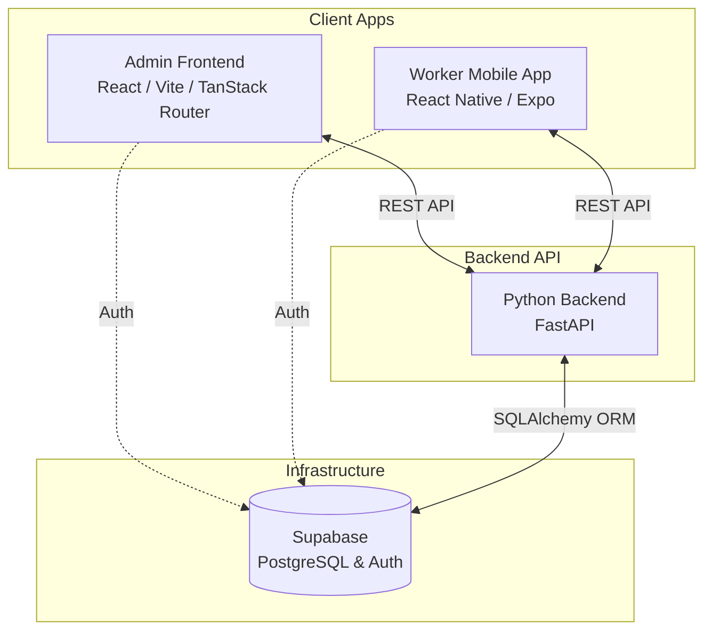

# Homecare App Software Architecture

This document provides a high-level overview of the software architecture and engineering patterns used across the Homecare App project. The system is built as a **monorepo** containing three main applications: a Python Backend, a React Admin Frontend, and an Expo React Native Mobile App.

It relies on a modern, decoupled architecture communicating via REST APIs, with **Supabase** acting as the underlying infrastructure for the PostgreSQL Database and Authentication.

---

## High-Level System Diagram

---

## 1. Backend (Python / FastAPI)
The backend serves as the core brain of the system, handling business logic, data validation, and scheduling rules. It is built with **FastAPI** and designed using a **Domain-Driven layered architecture**.

### Key Technologies
- **Framework:** FastAPI (Python)
- **ORM:** SQLAlchemy
- **Data Validation:** Pydantic (`schemas/`)
- **Database:** PostgreSQL (hosted via Supabase)

### Architecture Layers
The backend is strictly divided into layers to separate concerns, making the code testable and maintainable:
1. **API / Routers (`app/api/`)**: The entry points. These define the endpoints, parse incoming HTTP requests, and return HTTP responses. They contain *no* business logic, delegating work to Services.
2. **Services (`app/services/`)**: Orchestrates business workflows. For example, `placement_service.py` handles the complex process of filling a placement by calling repositories, validating business rules, generating shifts, and triggering notifications.
3. **Domain (`app/domain/`)**: Pure, isolated business logic and rules. Files here (like `availability.py` and `scheduling.py`) contain functions that take raw data and return answers (e.g., "Does this availability cover this care plan?"). They do not interact with the database.
4. **Repositories (`app/repositories/`)**: The Data Access Layer. These classes encapsulate all SQLAlchemy queries and database interactions.
5. **Models (`app/models/`)**: SQLAlchemy definitions mapping Python classes to database tables.

> [!TIP]
> **Why this matters:** By keeping pure logic in `domain` and database calls in `repositories`, you can easily unit test complex scheduling rules without needing a live database.

---

## 2. Admin Frontend (React Web)
The web console used by agency administrators to manage placements, workers, and clients.

### Key Technologies
- **Framework:** React + Vite
- **Routing:** `@tanstack/react-router` (Type-safe, file-based routing)
- **Styling:** Tailwind CSS + Custom UI Components
- **Data Fetching:** React Query (`@tanstack/react-query`)

### Frontend React Architecture: 4-Layer Mental Model (Feature-Sliced Design)
Both the Admin Frontend and Worker Mobile App strictly adhere to a highly scalable "Feature-Sliced Design", which perfectly maps to a **4-Layer Mental Model** for React components. Here is how that model maps to the codebase, using the **Worker Profile** as an example:

**Layer 1: Primitive / Foundational Components**
- **Purpose:** Purely about styling and interaction at the atomic level. No business logic. Highly reusable.
- **Location:** `src/shared/components/ui/`
- **Examples:** `<Avatar>`, `<Tag>`, `<Kicker>`, `<StatusDot>`, `<ProgressBar>`.
- *Analogy: The raw Lego bricks.*

**Layer 2: Compound / Composite Components**
- **Purpose:** Combine primitives into slightly richer, but generic, UI patterns.
- **Location:** `src/shared/components/ui/` or generic shared folders.
- **Examples:** `<Card>` (handles background, borders, paddings, but knows nothing about business data) or a generic `<Drawer>`.
- *Analogy: Small Lego assemblies (wheels, windows, doors).*

**Layer 3: Domain / Business Logic Components**
- **Purpose:** Bridge the gap between UI and business logic. They fetch data, handle state, and know the specific business domain.
- **Location:** `src/features/<domain_name>/components/` (e.g., `features/workers/`)
- **Examples:** `<WorkerCard>`, `<WorkerStatsSection>`, `<WorkerShiftHistory>`.
- *Analogy: A specific Lego house or car.*

**Layer 4: Application Shell / Pages**
- **Purpose:** The big containers that define routing, URL parameters, layouts, and global data providers. They compose multiple Domain components to build a full screen.
- **Location:** `src/routes/`
- **Examples:** `routes/_protected/dashboard/workers/$workerId.tsx` (The actual Worker Profile page).
- *Analogy: The completed Lego city.*

### The 5-Layer Call Stack (Example: The Worker Profile)
To understand how data flows through the Admin Frontend across these layers, let's walk through the exact call stack when an admin navigates to `/dashboard/workers/123`:

**1. Layer 1: Routing & App Shell (`routes/`)**
TanStack Router reads the URL and extracts the `$workerId`. It determines the global layout (like showing the sidebar) and renders the Domain components, passing down the ID.
*Example Location:* `src/routes/_protected/dashboard/workers/$workerId.tsx`

**2. Layer 2: Domain Component (`features/components/`)**
The `WorkerCard` component takes the `workerId` and needs to display data. It **does not** make an HTTP request itself. Instead, it calls a custom React Query hook.
*Example Location:* `src/features/workers/components/WorkerCard.tsx`

**3. Layer 3: React Query & State (`features/hooks/`)**
The `useWorker(workerId)` hook checks its in-memory cache. If the worker data isn't there, it calls the Raw API function to fetch it. While fetching, it returns `isLoading: true` to the Domain Component.
*Example Location:* `src/features/workers/hooks/useWorkers.ts`

**4. Layer 4: Raw API Call (`features/api.ts`)**
The `fetchWorker(workerId)` function uses `axios` to execute the actual HTTP `GET /api/admin/workers/123` request against the Python backend.
*Example Location:* `src/features/workers/api.ts`

**5. Layer 5: Primitive UI Components (`shared/ui/`)**
Once the API responds, React Query caches the JSON data and tells the Domain Component to re-render. The Domain Component then passes `worker.first_name` and `worker.last_name` down to pure UI components like `<Avatar>` or `<Card>`, which paint the final pixels onto the screen.
*Example Location:* `src/shared/components/ui/index.tsx`

> [!NOTE]
> This flow strictly separates concerns: UI doesn't fetch data, API files don't render HTML, and React Query smoothly handles all the loading states in between!

---

## 3. Worker Mobile App (React Native)
The mobile app used by care workers to view their shifts, express interest in placements, and manage their availability.

### Key Technologies
- **Framework:** React Native + Expo
- **Routing:** Expo Router (File-based routing)
- **Styling:** NativeWind (Tailwind CSS for React Native)

### Implementation
Follows the exact same mental model as the Admin Frontend. Screens map directly to URLs/deep-links using Expo Router, while UI components are separated into `src/features/` and `src/shared/`.

> [!NOTE]
> **Local Development Routing:** When running locally, mobile devices often can't hit `localhost` directly. Your setup uses **localtunnel** (`loca.lt`) to expose the local Python backend to the public internet so the Expo app on your phone/simulator can communicate with the API seamlessly.
